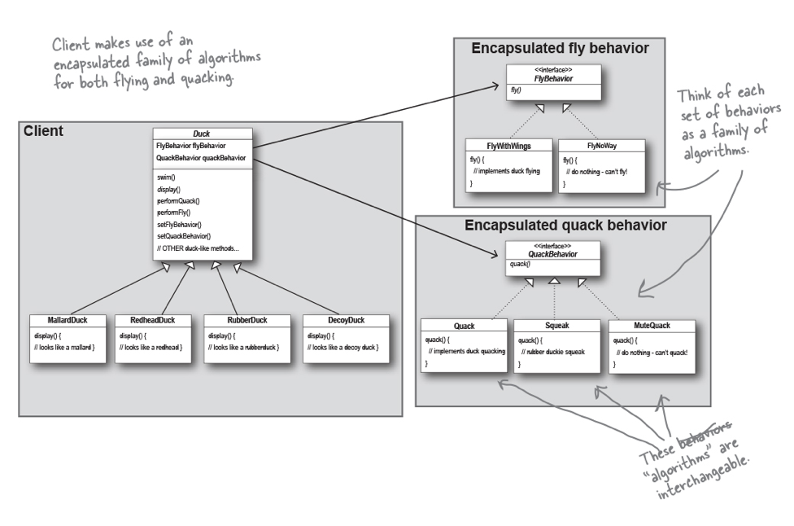
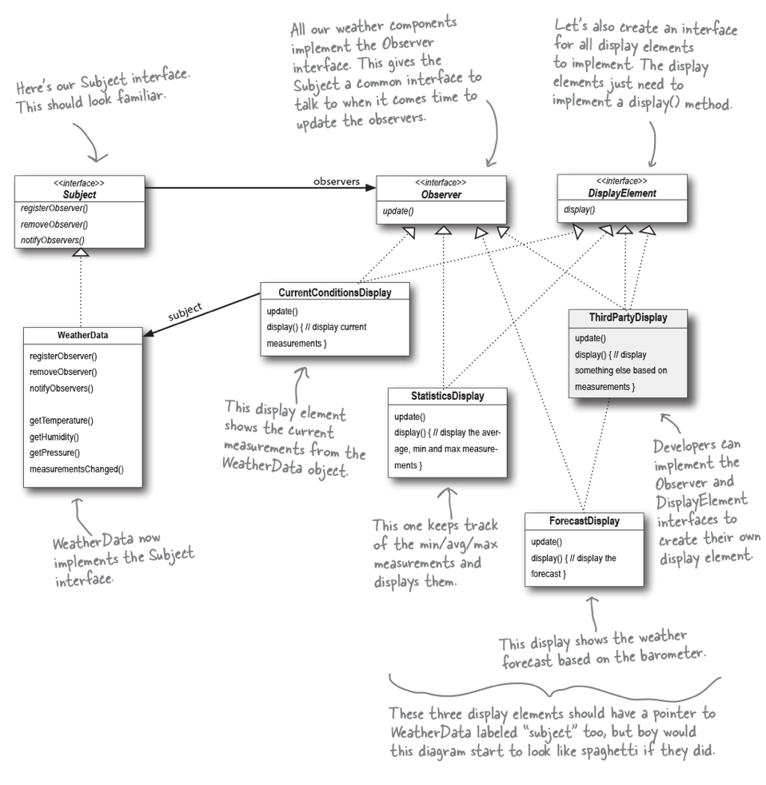
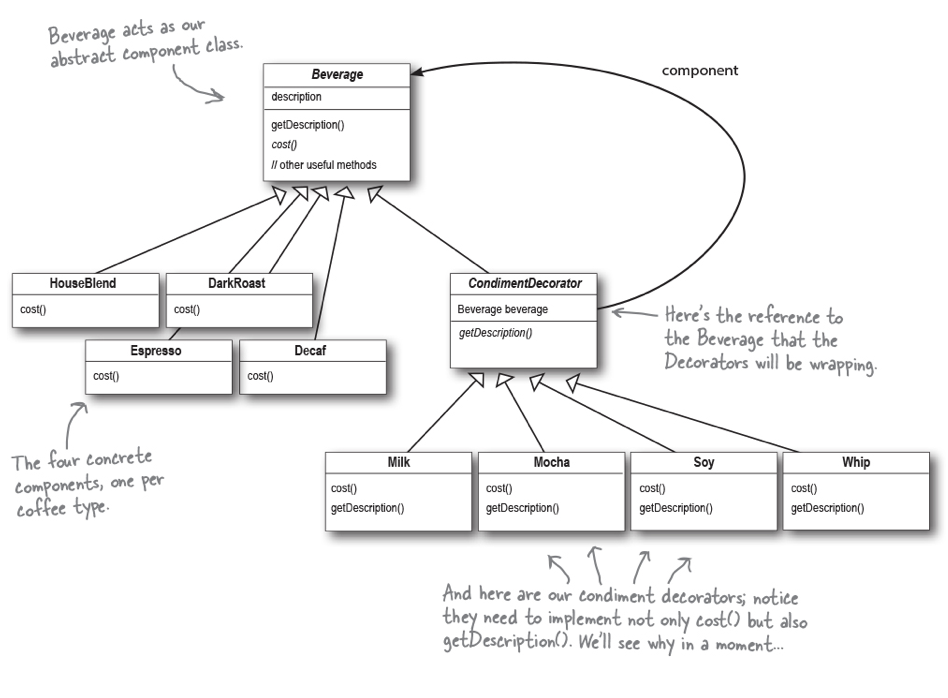
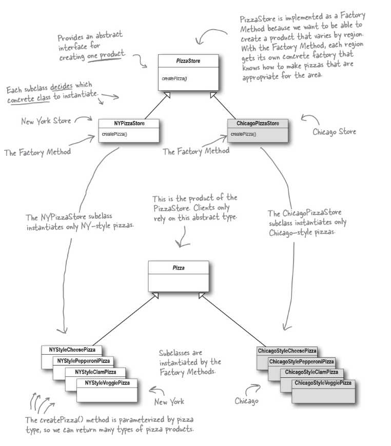
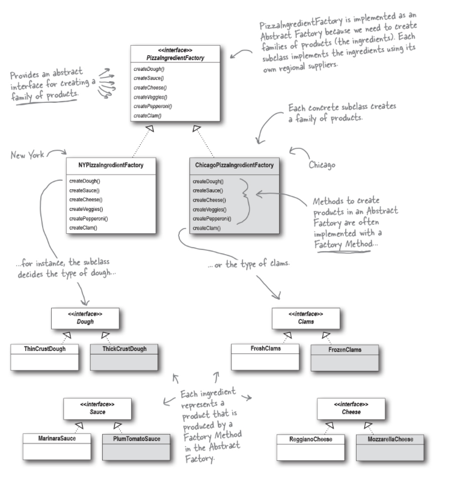

# Design Principles 

Strategy Pattern
----------------

Strategy - defines a family of algorithms, encapsulates each one, and makes them interchangeable. Strategy lets the algorithm vary independently from clients that use it.

1) Identify the aspects of your application that vary and separate them from what stays the same.
2) Program to an interface, not an implementation.
3) Favor composition over inheritance.

Observer Pattern
----------------

Observer - defines a one-to-many dependency between objects so that when one object changes state, all its dependents are notified and updated automatically

1) Strive for loosely coupled designs between objects that interact.

Decorator Pattern
-----------------

Decorator - attaches additional responsibilities to an object dynamically. Decorators provide a flexible alternative to subclassing for extending functionality.

1) Classes should be open for extension, but closed for modification.

Factory Pattern
-----------------

Abstract Factory - Provides an interface for creating families of related or dependent objects without
specifying their concrete classes.

Factory Method - Defines an interface for creating an object, but let subclasses decide which class to instantiate. Factory Method lets a class defer instantiation to the
subclasses.

1) Depend upon abstractions. Do not depend upon concrete classes.

Singleton Pattern
-----------------

