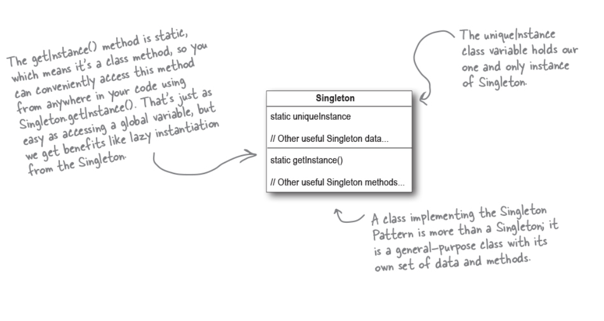
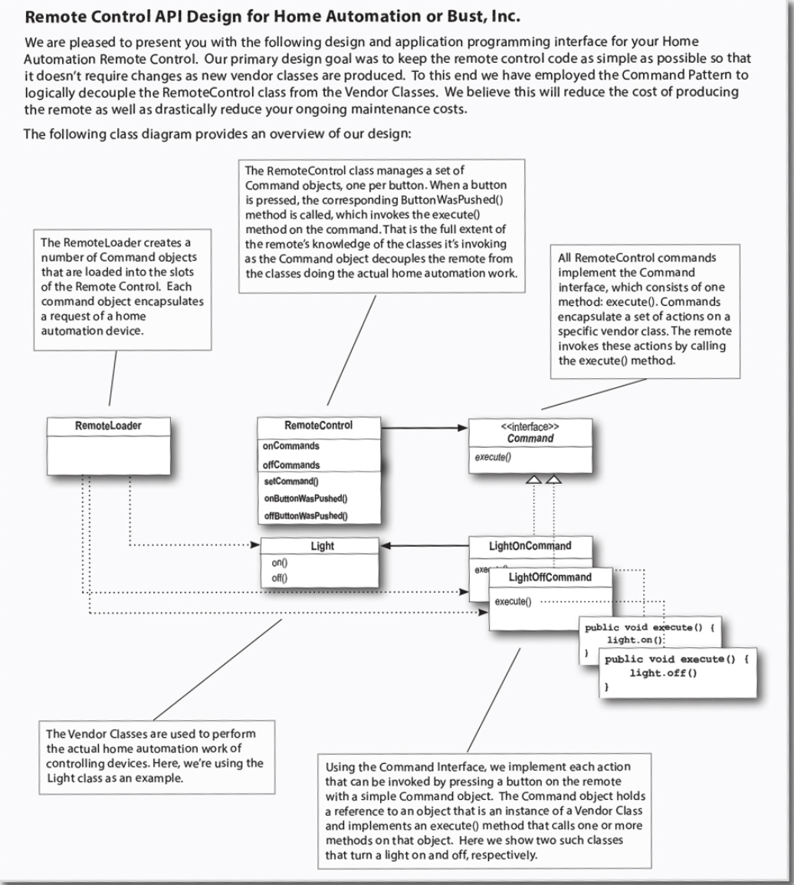
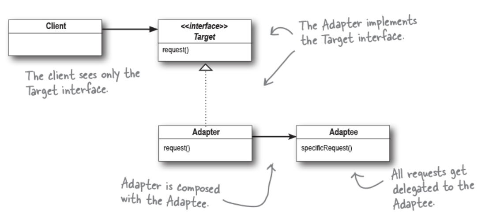
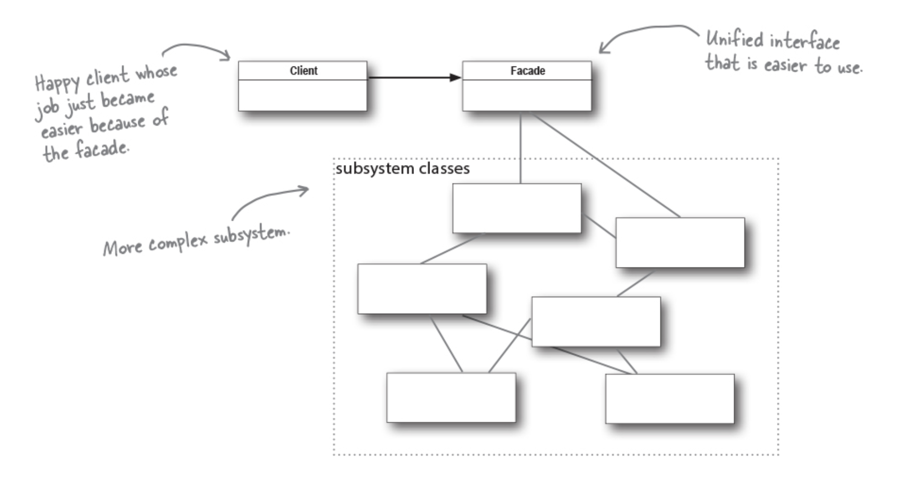
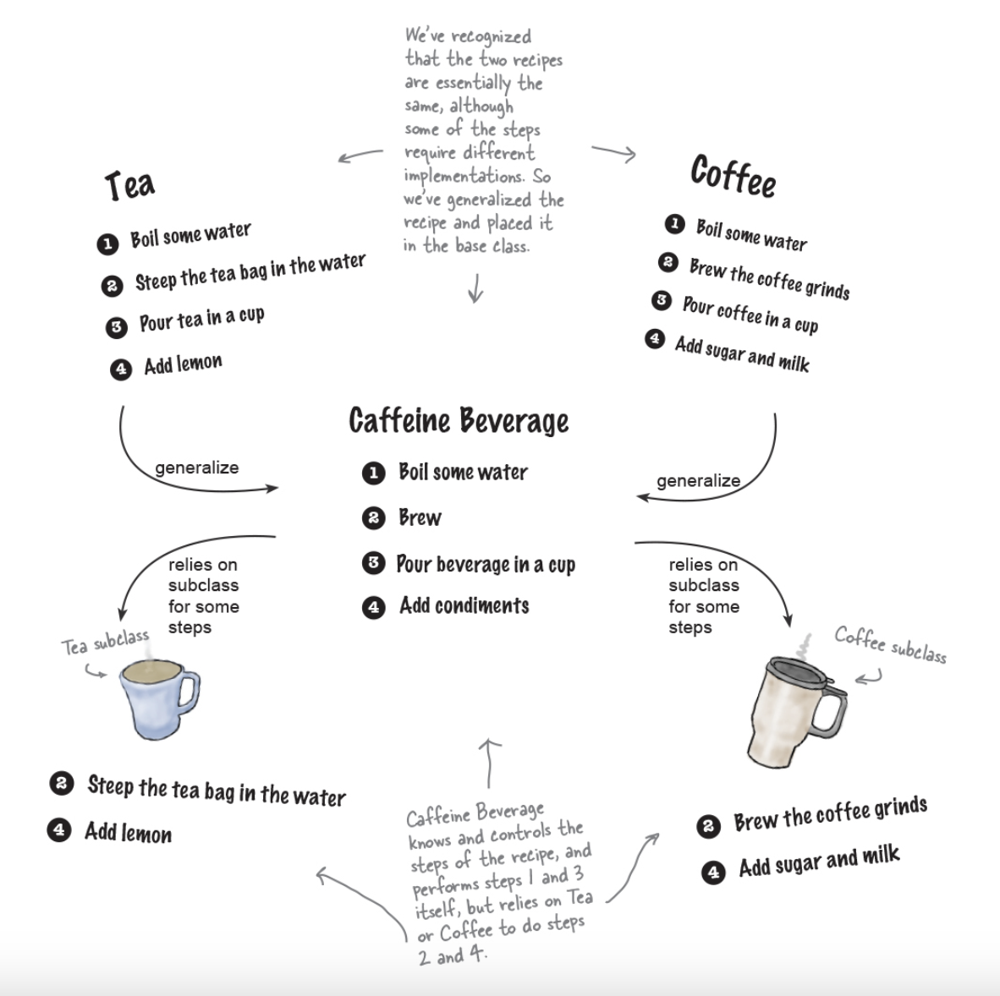
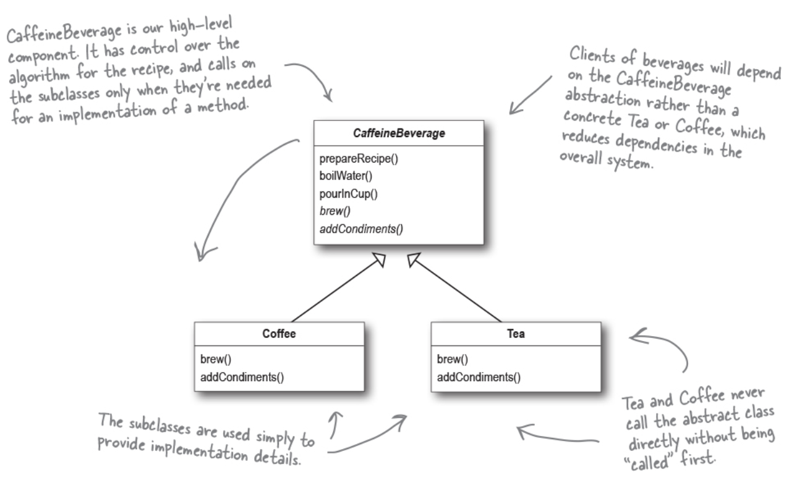
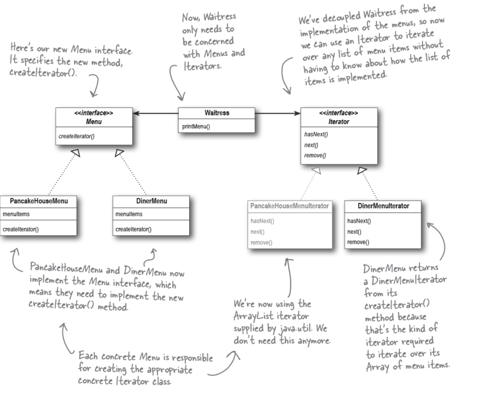
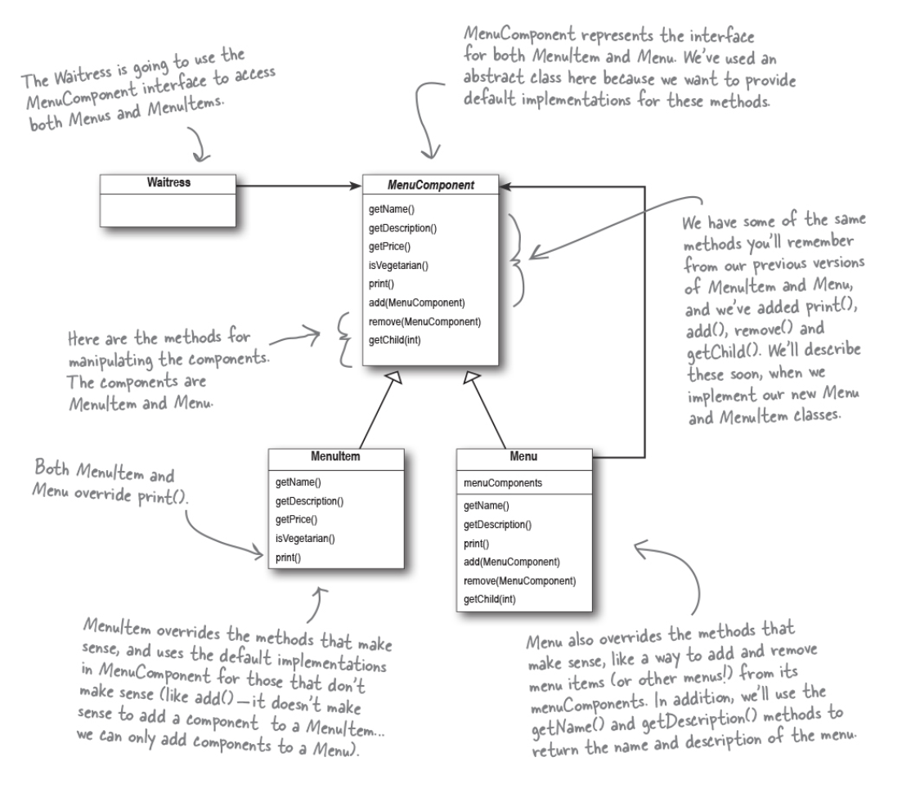

<!-- omit in toc -->
# Design Patterns 
- [Strategy Pattern](#strategy-pattern)
- [Observer Pattern](#observer-pattern)
- [Decorator Pattern](#decorator-pattern)
- [Factory Pattern](#factory-pattern)
- [Singleton Pattern](#singleton-pattern)
- [Command Pattern](#command-pattern)
- [Adapter and Facade Pattern](#adapter-and-facade-pattern)
- [Template Method Pattern](#template-method-pattern)
- [Iterator and Composite Pattern](#iterator-and-composite-pattern)

Strategy Pattern
----------------

Strategy - defines a family of algorithms, encapsulates each one, and makes them interchangeable. Strategy lets the algorithm vary independently from clients that use it.

1) Identify the aspects of your application that vary and separate them from what stays the same.
2) Program to an interface, not an implementation.
3) Favor composition over inheritance.

Observer Pattern
----------------

Observer - defines a one-to-many dependency between objects so that when one object changes state, all its dependents are notified and updated automatically

1) Strive for loosely coupled designs between objects that interact.

Decorator Pattern
-----------------

Decorator - attaches additional responsibilities to an object dynamically. Decorators provide a flexible alternative to subclassing for extending functionality.

1) Classes should be open for extension, but closed for modification.

Factory Pattern
-----------------

Abstract Factory - Provides an interface for creating families of related or dependent objects without
specifying their concrete classes.

Factory Method - Defines an interface for creating an object, but let subclasses decide which class to instantiate. Factory Method lets a class defer instantiation to the
subclasses.

1) Depend upon abstractions. Do not depend upon concrete classes.

Singleton Pattern
-----------------

Singleton - ensures a class has only one instance, and provides a global point of access to it.

Command Pattern
-----------------

Command - encapsulates a request as an object, thereby letting you parameterize clients with different requests, queue or log requests, and support undoable operations.

Adapter and Facade Pattern
-----------------

Adapter - converts the interface of a class into another interface the clients expect. Adapter lets classes work together that couldn’t otherwise because of incompatible interfaces.

Pattern | Intent
--- | ---
Decorator | Attach additional responsibilities to an object dynamically. Decorators provide a flexible alternative to subclassing for extending functionality.
Adapter | Convert the interface of a class into another interface clients expect. Adapter lets classes work together that couldn’t otherwise because of incompatible interfaces.
Facade | Provide a unified interface to a set of interfaces in a subsystem. Facade defines a higher-level interface that makes the subsystem easier to use.

Design Principle:
- Principle of Lease Knowledge: Talk only to your immediate friends.
  
This principle prevents us from creating designs that have a large number of classes coupled together so that changes in one part of the system cascade to other parts.

Template Method Pattern
-----------------

Template Method - defines the skeleton of an algorithm in a method, deferring some steps to subclasses. Template Method lets subclasses redefine certain steps of an algorithm without changing the algorithm’s structure.

Hollywood Principle: Don’t call us, we’ll call you.

With the Template Method, we allow low-level components to hook themselves into a system, but the high-level components determine when they are needed, and how.

Patterns | Description
--- | ---
Template Method | Defines the skeleton of an algorithm in a method, deferring some steps to subclasses. Template Method lets subclasses redefine certain steps of an algorithm without changing the algorithm’s structure.
Strategy | Defines a family of algorithms, encapsulates each one, and makes them interchangeable. Strategy lets the algorithm vary independently from clients that use it.
Factory Method | Defines an interface for creating an object, but let subclasses decide which class to instantiate. Factory Method lets a class defer instantiation to the subclasses.

Iterator and Composite Pattern
-----------------

Iterator - provides a way to access the elements of an aggregate object sequentially without exposing its underlying representation.

Composite - compose objects into tree structures to represent part-whole hierarchies. Composite lets clients treat individual objects and compositions of objects uniformly.

Design Principle: A Class should have only one reason to change.

Cohesion - is a term that is used to indicate how focused and single-minded a class is. A class with high cohesion has a single purpose or responsibility and the class is well-focused on that purpose. A class with low cohesion has many purposes or responsibilities and is not focused on just one purpose.